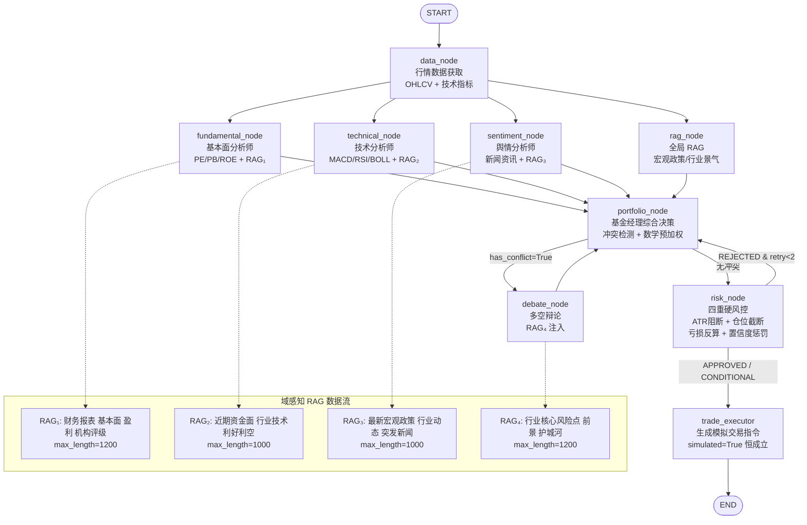

# CampusQuant — 校园财商智能分析平台

**核心矛盾**：大模型输出的概率性不确定性，对上金融合规的零容忍。CampusQuant 的全部工程设计，都是在这两者之间寻找可运行的工程解。

---

## 系统架构



**节点说明**：
- 4路并行（fundamental / technical / sentiment / rag）后汇聚至 portfolio_node
- 辩论循环上限：`MAX_DEBATE_ROUNDS = 2`
- 风控重试上限：`MAX_RISK_RETRIES = 2`
- 工具调用防死循环：`MAX_TOOL_CALLS = 3`（Anti-Loop 机制）

---

## 核心亮点

### 1. 域感知 RAG 路由（Per-Node Specialized Retrieval）

每个分析节点拥有**独立的 RAG 检索查询**，而非共享通用查询。这解决了"一个 RAG 查询服务所有节点导致的信息域偏差"问题。

| 节点 | RAG Query 模板 | max_length | 注入标签 |
|------|--------------|-----------|---------|
| fundamental_node | `{symbol} 财务报表 基本面 盈利 机构评级` | 1200 | 【研报知识库 — 基本面专项检索】 |
| technical_node | `{symbol} 近期资金面 行业技术利好利空` | 1000 | 【研报知识库 — 资金面与行业技术专项检索】 |
| sentiment_node | `{symbol} 最新宏观政策 行业动态 突发新闻` | 1000 | 【研报知识库 — 宏观政策与行业动态专项检索】 |
| debate_node | `{symbol} 行业核心风险点 前景 护城河` | 1200 | 【外部研报与宏观事实（作为裁判裁决依据）】 |

**关键代码**（`graph/nodes.py`，fundamental_node）：
```python
fund_rag_context = search_knowledge_base.invoke({
    "query":       f"{symbol} 财务报表 基本面 盈利 机构评级",
    "market_type": market_type,
    "max_length":  1200,
})
```

所有 Per-Node RAG 调用均有 `try/except + logger.warning` 降级保护，RAG 失败不会中断分析流程。

---

### 2. AI 置信度惩罚公式（Confidence Penalty）

**问题**：LLM 综合置信度 < 0.55 时，任何仓位建议都是高噪声输出，直接执行会增加用户亏损风险。

**解决方案**：在 `trade_executor` 调用 LLM 之前，对 LLM 输出的 `(action, position_pct)` 施加代码层惩罚。

```python
# graph/nodes.py
_CONF_FLOOR     = 0.40   # 低于此值强制 HOLD，仓位归零
_CONF_THRESHOLD = 0.55   # 低于此值线性缩仓（惩罚带）

def _apply_confidence_penalty(action, confidence, base_pct):
    if confidence < _CONF_FLOOR:
        return "HOLD", 0.0, f"置信度 {confidence:.2f} < 0.40，强制HOLD，仓位归零"

    if confidence < _CONF_THRESHOLD:
        scale = (confidence - _CONF_FLOOR) / (_CONF_THRESHOLD - _CONF_FLOOR)
        penalized_pct = round(base_pct * scale, 2)
        return action, penalized_pct, f"置信度惩罚带: {base_pct}×{scale:.3f}={penalized_pct:.2f}%"

    return action, base_pct, None
```

**数字示例**：

| 置信度 | 阶段 | base_pct=10% | 最终仓位 |
|--------|------|-------------|--------|
| 0.35 | 强制 HOLD | — | **0.0%** (HOLD) |
| 0.40 | 惩罚带边界 | 10% × 0.000 | **0.0%** |
| 0.475 | 惩罚带中点 | 10% × 0.500 | **5.0%** |
| 0.55 | 恢复正常 | 10% × 1.000 | **10.0%** |
| 0.80 | 正常区间 | — | **10.0%** (无惩罚) |

---

### 3. 四重硬风控（代码层截断，非 Prompt 约束）

| 风控层 | 触发条件 | 执行方式 | 代码位置 |
|--------|---------|---------|---------|
| ATR 硬阻断 | ATR% > 8.0% | 强制 REJECTED，仓位归零 | `_apply_atr_hard_block()` |
| ATR 减半 | ATR% > 5.0% | 强制 CONDITIONAL，仓位减半 | `_apply_atr_hard_block()` |
| 仓位上限截断 | A股 > 15% / 港美 > 10% | 强制截断到上限 | `risk_node` L1760-1769 |
| 单次亏损反算 | 亏损 > 3000元 | 反算最大安全仓位并截断 | `_apply_max_loss_cap()` |

**ATR 硬阻断代码**（`graph/nodes.py`）：
```python
_ATR_HARD_REJECT = 8.0   # ATR% 超过此值：强制 REJECTED，仓位归零
_ATR_CONDITIONAL = 5.0   # ATR% 超过此值：CONDITIONAL，仓位减半

def _apply_atr_hard_block(approval_status, position_pct, atr_pct):
    if atr_pct > _ATR_HARD_REJECT:
        return "REJECTED", 0.0, f"ATR% {atr_pct:.1f}% > 8%（代码硬阻断）"
    if atr_pct > _ATR_CONDITIONAL:
        new_pct = round(position_pct / 2.0, 2)
        return "CONDITIONAL", new_pct, f"ATR% {atr_pct:.1f}% > 5%（仓位减半至{new_pct:.1f}%）"
    return approval_status, position_pct, None
```

**单次亏损反算公式**（3000元上限）：
```python
_MAX_SINGLE_LOSS_CNY = 3000.0    # 单次最大亏损金额
_ASSUMED_CAPITAL_CNY = 50000.0   # 假设大学生总本金

max_safe_pct = (_MAX_SINGLE_LOSS_CNY / _ASSUMED_CAPITAL_CNY) / (stop_loss_pct / 100) * 100
# 示例：止损7% → max_safe = (3000/50000)/0.07×100 = 85.7%（不触发）
# 示例：止损50% → max_safe = (3000/50000)/0.50×100 = 12.0%（触发截断）
```

**设计原则**：这些截断都在 LLM 调用结果之后执行，是代码硬覆盖，LLM 无法通过修改 Prompt 输出绕过。

---

### 4. RRF 多路融合检索（BM25 + Chroma + DuckDuckGo）

知识库采用三路信息源融合：

```
本地 data/docs/ 研报PDF
        ├─ BM25 关键词检索（精准词匹配、股票代码）     ─┐
        └─ Chroma 向量语义检索（概念相似、同义词理解） ─┤─ EnsembleRetriever
                                                        │   RRF 排名融合
                                                        └─ Top-K 去重
DuckDuckGo 实时联网搜索（突发新闻、最新财报）
```

**RRF double-hit 公式**（`tools/knowledge_base.py`）：
```
每路检索结果: score(rank) = 1 / (rank + 60)
融合得分 = Σ score(rank_i)  for each retriever

例：query="NVDA AI芯片出货量"
  BM25 中含"NVDA"段落 rank=1 → score = 1/61 ≈ 0.0164
  Chroma 中含"英伟达"段落 rank=1 → score = 1/61 ≈ 0.0164
  若某段落同时被两路检出（double-hit）：融合得分 = 1/61 + 1/62 ≈ 0.0328 → 排名第一
```

权重配置：BM25 50% + Chroma 50%（`weights=[0.5, 0.5]`）。

---

## 快速启动

**环境要求**：Python 3.10+，配置 `.env`（DASHSCOPE_API_KEY）

```bash
# 后端（FastAPI SSE 流式接口）
uvicorn api.server:app --host 127.0.0.1 --port 8000 --reload

# 前端（静态 HTML，访问 http://localhost:3000）
python -m http.server 3000
```

**可选：构建 RAG 知识库索引**（首次运行前执行，之后跳过）
```bash
python scripts/build_kb.py
```

**可选：Streamlit 界面**
```bash
streamlit run app.py  # → http://localhost:8501
```

## Cloudflare Workers Relay

For Hong Kong and US market data in mainland deployment environments, you can enable a Cloudflare Workers relay.

Mainland application `.env`:

```env
MARKET_RELAY_BASE_URL=https://your-worker.your-subdomain.workers.dev
MARKET_RELAY_TOKEN=replace-me
```

Worker template:

- `cloudflare_worker/market-relay/worker.js`
- `cloudflare_worker/market-relay/wrangler.toml.example`

Current relay coverage:

- HK/US spot price
- HK/US batch quotes
- HK/US kline

---

## D1-D4 四维评测体系

CampusQuant 使用四维评测协议量化系统质量，每次 Prompt 调优或风控参数调整后可跑一遍评测验证效果。

### 公式

```
Acc_w = 0.20 × D1 + 0.30 × D2 + 0.30 × D3 + 0.20 × D4
```

### 各维度说明

| 维度 | 评测内容 | Pass 条件 | 权重 |
|------|---------|----------|------|
| D1 市场分类 | A股/港股/美股三级分类准确性 | 三级分类正确 | 20% |
| D2 数据获取 | akshare/yfinance 数据获取成功率 | 返回有效 OHLCV 不为空 | 30% |
| D3 研报完整性 | 三大分析师报告字段完整、置信度非默认 | recommendation + confidence + reasoning 均有效 | 30% |
| D4 风控合规 | 最终 TradeOrder 满足所有风控红线 | simulated=True，仓位在上限内，止损 > 0 | 20% |

**测试集**：50 只股票（A股 20 + 港股 15 + 美股 15）

**内测结果**：
- D1 = D2 ≈ 100%（分类靠三级兜底，数据靠双路并发+日线降级）
- D3 ≈ D4 ≈ 83%（少量因 LLM 超时或格式不规范未通过）
- 代入公式：`0.20×1.0 + 0.30×1.0 + 0.30×0.83 + 0.20×0.83 ≈ 0.92` → **综合准确率约 90%**

**运行评测**：
```bash
# 快速模式（D1+D2，无 LLM 调用，约 30s）
python eval_pipeline.py

# 完整模式（D1+D2+D3+D4，随机抽5只跑 LLM pipeline）
python eval_pipeline.py --llm --sample 5
```

---

## SSE 事件类型

FastAPI 后端通过 Server-Sent Events 实时推送分析进度。

| 事件类型 | 触发时机 |
|---------|---------|
| `start` | 分析请求受理，引擎启动 |
| `node_start` | 某节点开始执行 |
| `node_complete` | 某节点执行完毕，携带结构化数据 |
| `conflict` | 基本面与技术面冲突，触发辩论 |
| `debate` | 辩论节点完成，携带裁决结果 |
| `risk_check` | 风控审批结果（APPROVED/CONDITIONAL/REJECTED） |
| `risk_retry` | 风控拒绝，要求 portfolio_node 修订 |
| `trade_order` | 最终模拟交易指令生成 |
| `complete` | 全流程完成 |
| `error` | 发生错误（含 error_type 细粒度归因） |

---

## 项目结构

```
trading_agents_system/
├── graph/
│   ├── nodes.py       # 所有 LangGraph 节点函数 + 风控函数
│   ├── state.py       # TradingGraphState TypedDict + Pydantic 模型
│   └── builder.py     # StateGraph DAG 装配
├── tools/
│   ├── market_data.py # akshare / yfinance 数据获取
│   └── knowledge_base.py  # BM25 + Chroma + DuckDuckGo 混合 RAG
├── api/
│   └── server.py      # FastAPI SSE 流式后端
├── eval_pipeline.py   # D1-D4 四维评测流水线
├── tests/
│   └── test_extreme_cases.py  # 63 个极端用例单元测试
├── data/
│   ├── docs/          # 放入研报 PDF/TXT（RAG 文档源）
│   └── chroma_db/     # Chroma 向量库持久化（自动生成）
└── scripts/
    └── build_kb.py    # 离线建库脚本（一次性运行）
```

---

## 安全红线

- **无真实交易所 API**：无 Binance、CCXT、IBKR 等
- **TradeOrder.simulated 恒为 True**：代码层在 trade_executor 末尾强制覆盖，LLM 无法绕过
- **无加密货币业务逻辑**：系统仅支持 A股/港股/美股

---

## 技术栈

| 层 | 技术选型 |
|----|---------|
| LLM | DashScope/Qwen（主）、OpenAI/Anthropic（备） |
| Agent 框架 | LangGraph（StateGraph + 条件边） |
| 向量数据库 | Chroma（持久化） |
| 关键词检索 | rank_bm25 |
| 实时搜索 | DuckDuckGo（无 API Key） |
| 市场数据 | akshare（A股/港股）、yfinance（美股） |
| 后端 | FastAPI + SSE |
| 前端 | 静态 HTML8页（无框架） |
| 数据库 | SQLite（用户/订单持久化） |


服务器分配规则
──────────┬─────────────────────────────┬───────────────────────────────┐     │   服务   │          来源文件           │             原因              │     ├──────────┼─────────────────────────────┼───────────────────────────────┤     │ A 股 K   │ ak.stock_zh_a_hist,         │                               │     │ 线       │ stock_zh_a_hist_tx,         │ 东财/新浪接口，必须内地 IP    │     │          │ stock_zh_a_daily            │                               │     ├──────────┼─────────────────────────────┼───────────────────────────────┤     │ A 股实时 │ ak.stock_zh_a_spot_em,      │ 同上                          │     │ 行情     │ stock_zh_a_spot             │                               │     ├──────────┼─────────────────────────────┼───────────────────────────────┤     │ A 股指数 │ ak.stock_zh_index_spot_em,  │ 同上                          │     │          │ stock_zh_index_spot_sina    │                               │     ├──────────┼─────────────────────────────┼───────────────────────────────┤     │ 港股行情 │ ak.stock_hk_spot_em         │ 东财接口，内地访问更稳        │   
  │ 表       │                             │                               │
  ├──────────┼─────────────────────────────┼───────────────────────────────┤   
  │ 美股行情 │ ak.stock_us_spot_em         │ 同上                          │   
  │ 表       │                             │                               │   
  ├──────────┼─────────────────────────────┼───────────────────────────────┤   
  │ 港股 K   │                             │                               │   
  │ 线 (aksh │ ak.stock_hk_daily           │ 新浪接口，内地 IP             │   
  │ are)     │                             │                               │   
  ├──────────┼─────────────────────────────┼───────────────────────────────┤   
  │ 美股 K   │                             │                               │   
  │ 线 (aksh │ ak.stock_us_daily           │ 同上                          │   
  │ are)     │                             │                               │   
  ├──────────┼─────────────────────────────┼───────────────────────────────┤   
  │ 财务摘要 │ ak.stock_financial_abstract │ 同花顺接口                    │   
  │          │ _ths                        │                               │   
  ├──────────┼─────────────────────────────┼───────────────────────────────┤   
  │ 个股新闻 │ ak.stock_news_em            │ 东财接口                      │   
  ├──────────┼─────────────────────────────┼───────────────────────────────┤   
  │ 财联社快 │ ak.stock_info_global_cls    │ 财联社接口                    │   
  │ 讯       │                             │                               │   
  ├──────────┼─────────────────────────────┼───────────────────────────────┤   
  │          │ ak.stock_board_industry_nam │                               │   
  │ 板块数据 │ e_em,                       │ 东财接口                      │   
  │          │ stock_board_concept_name_em │                               │   
  ├──────────┼─────────────────────────────┼───────────────────────────────┤   
  │ 北向资金 │ ak.stock_hsgt_fund_flow_sum │ 东财接口                      │   
  │          │ mary_em                     │                               │   
  ├──────────┼─────────────────────────────┼───────────────────────────────┤   
  │ 新浪财经 │ requests.get("zhibo.sina.co │ 国内接口                      │   
  │ 直播     │ m.cn/...")                  │                               │   
  ├──────────┼─────────────────────────────┼───────────────────────────────┤   
  │ 澎湃新闻 │ requests.get("cache.thepape │ 国内接口                      │   
  │          │ r.cn/...")                  │                               │   
  ├──────────┼─────────────────────────────┼───────────────────────────────┤   
  │ MySQL    │ db/engine.py → 8.156.85.111 │ 数据库本身就在阿里云内地，放  │   
  │ 数据库   │                             │ 一起延迟最低                  │   
  └──────────┴─────────────────────────────┴───────────────────────────────┘   

  内存预估：FastAPI + akshare + 内存缓存 ≈ 300-500MB，2GiB 够用

  ---
  香港服务器（2C / 1GiB / ?M）— 主站 + Agent 逻辑

  ┌──────────────────┬──────────────────────────────────┬──────────────────┐   
  │       服务       │             来源文件             │       原因       │   
  ├──────────────────┼──────────────────────────────────┼──────────────────┤   
  │ FastAPI 主站     │ api/server.py                    │ 用户入口，SSE    │   
  │                  │                                  │ 流式             │   
  ├──────────────────┼──────────────────────────────────┼──────────────────┤   
  │ LangGraph Agent  │ graph/nodes.py, graph/builder.py │ 纯逻辑调度，不吃 │   
  │ 全流程           │                                  │ 内存             │   
  ├──────────────────┼──────────────────────────────────┼──────────────────┤   
  │ LLM 调用 (Qwen/O │ utils/llm_client.py              │ 只发 HTTP 请求， │   
  │ penAI/Claude)    │                                  │ 模型在云端跑     │   
  ├──────────────────┼──────────────────────────────────┼──────────────────┤   
  │ 港美股 Relay     │ market_data.py → CF Workers      │ 香港直连 CF      │   
  │                  │                                  │ Workers 延迟最低 │   
  ├──────────────────┼──────────────────────────────────┼──────────────────┤   
  │ yfinance 港美股  │ yf.Ticker().history()            │ 香港直连 Yahoo   │   
  │                  │                                  │ Finance 无障碍   │   
  ├──────────────────┼──────────────────────────────────┼──────────────────┤   
  │ 华尔街见闻 API   │ requests.get("api.wallstreetcn.c │ 国际接口         │   
  │                  │ om/...")                         │                  │   
  ├──────────────────┼──────────────────────────────────┼──────────────────┤   
  │ DuckDuckGo 搜索  │ tools/knowledge_base.py          │ 国际搜索引擎     │   
  ├──────────────────┼──────────────────────────────────┼──────────────────┤   
  │ 前端静态页       │ 8 个 HTML 文件                   │ Nginx 静态托管   │   
  ├──────────────────┼──────────────────────────────────┼──────────────────┤   
  │ JWT 鉴权         │ api/auth.py                      │ 纯计算，无外部依 │   
  │                  │                                  │ 赖               │   
  ├──────────────────┼──────────────────────────────────┼──────────────────┤   
  │ 模拟撮合         │ api/mock_exchange.py             │ 纯内存计算       │   
  ├──────────────────┼──────────────────────────────────┼──────────────────┤   
  │ 技术指标计算     │ agents/technical_agent.py        │ pandas 运算，500 │   
  │                  │                                  │  行数据很轻      │   
  └──────────────────┴──────────────────────────────────┴──────────────────┘   

  ---
  关键问题：1GiB 够不够？

  ┌───────────────────────┬────────────┐
  │         组件          │  内存占用  │
  ├───────────────────────┼────────────┤
  │ FastAPI + uvicorn     │ ~80MB      │
  ├───────────────────────┼────────────┤
  │ LangGraph + LangChain │ ~100MB     │
  ├───────────────────────┼────────────┤
  │ pandas + 技术指标     │ ~50MB      │
  ├───────────────────────┼────────────┤
  │ Chroma 向量库         │ ~200-400MB │
  ├───────────────────────┼────────────┤
  │ BM25 索引             │ ~10MB      │
  ├───────────────────────┼────────────┤
  │ 内存缓存（转发层）    │ ~30MB      │
  ├───────────────────────┼────────────┤
  │ 合计                  │ ~470-670MB │
  └───────────────────────┴────────────┘

  Chroma 是最大风险。如果你的 RAG 知识库文档多（>100 篇研报），Chroma
  加载后可能直接把 1GiB 撑爆。


把 RAG 也搬到内地服务器
  - 香港只剩 Agent 调度 + LLM 转发，内存降到 ~250MB，1GiB 很安全
  - 内地服务器同时承担数据 + RAG + DB，2GiB 刚好够


  ---
  调用关系总图

  用户浏览器
      │
      ▼
  ┌─────────────────────────────────────────────┐
  │  香港服务器 (2C/1G)                          │
  │  ┌─────────┐  ┌──────────┐  ┌────────────┐ │
  │  │ Nginx   │→ │ FastAPI  │→ │ LangGraph  │ │
  │  │ 静态页  │  │ SSE/REST │  │ Agent 调度 │ │
  │  └─────────┘  └────┬─────┘  └─────┬──────┘ │
  │                    │              │         │
  │    ┌───────────────┼──────────────┤         │
  │    ▼               ▼              ▼         │
  │  DashScope    CF Workers     yfinance      │
  │  (LLM调用)   (港美股relay)  (港美股数据)    │
  └────────────────────┬────────────────────────┘
                       │ A股数据/新闻/指数/财务/DB
                       ▼
  ┌─────────────────────────────────────────────┐
  │  内地服务器 (2C/2G)                          │
  │  ┌──────────────┐  ┌────────┐  ┌─────────┐ │
  │  │ A股数据 API  │  │ MySQL  │  │ (可选)  │ │
  │  │ akshare全量  │  │ 用户DB │  │ Chroma  │ │
  │  │ +内存缓存    │  │        │  │ RAG     │ │
  │  └──────────────┘  └────────┘  └─────────┘ │
  └─────────────────────────────────────────────┘