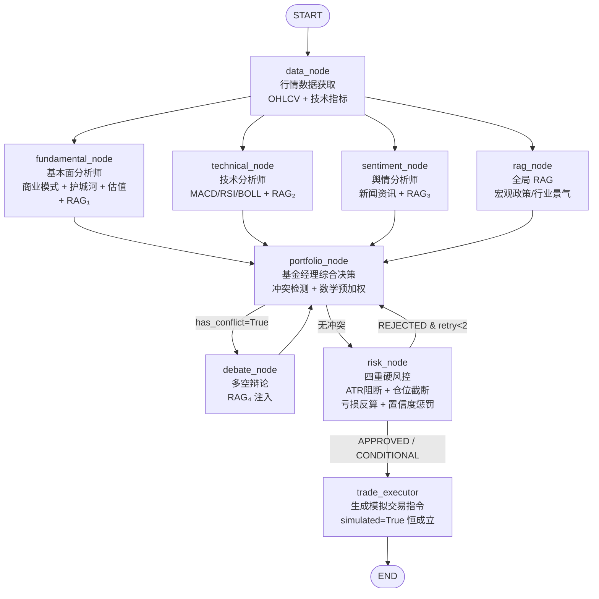

# CampusQuant — 校园财商智能分析平台

基于 LangGraph 的多 Agent AI 投资研究平台，面向中国大学生。覆盖 A 股、港股、美股，集成混合 RAG 和金融风控体系。

**核心设计理念**：大模型输出的概率性不确定性 vs 金融合规的零容忍 — 全部工程设计都在这两者之间寻找可运行的工程解。

**线上访问**：http://47.76.197.100

---

## 系统架构



**控制参数**：
- 辩论循环上限：`MAX_DEBATE_ROUNDS = 2`
- 风控重试上限：`MAX_RISK_RETRIES = 2`
- 工具调用防死循环：`MAX_TOOL_CALLS = 3`（Anti-Loop 机制）

---

## 分析维度

### 基本面分析（fundamental_node）

每次分析**必须覆盖**以下 6 个维度：

1. **商业模式 & 收入驱动** — 公司靠什么赚钱？主营业务和收入结构
2. **护城河 & 竞争优势** — 品牌、技术壁垒、网络效应、规模效应
3. **催化剂** — 未来 1-2 个季度可能推动股价变动的事件
4. **同行对比** — 相对于同行业公司，估值偏高还是偏低
5. **情景分析** — 乐观/悲观两种情景
6. **投资论点** — 2-3 句话概括推荐/不推荐理由

市场差异化权重（`_MARKET_WEIGHTS`）：

| 市场 | 基本面 | 技术面 | 情绪面 | 分析侧重 |
|------|--------|--------|--------|----------|
| A 股 | 40% | 25% | 35% | 政策驱动 + 景气度，情绪含宏观政策上下文 |
| 港股 | 55% | 20% | 25% | 价值投资导向，FCF + 分红 |
| 美股 | 50% | 25% | 25% | 基本面主导，EPS + FCF |

### 技术面分析（technical_node）

MA5/20/60 趋势 + MACD 动量 + RSI14/BOLL 超买超卖 + 量比量价关系 + ATR 波动率。多重信号共振时才发出强信号。

### 情绪分析（sentiment_node）

资金热度 + 宏观政策面 + 板块轮动 + 极端情绪信号。数据源：akshare 个股新闻 + yfinance + DuckDuckGo 实时搜索。

---

## 研报输出格式

最终报告采用**论文式研报**结构（非 Agent dump）：

```
投资建议（推荐/置信度/仓位/止损/止盈）
├── 投资论点
├── 商业模式 & 收入驱动
├── 护城河 & 竞争优势
├── 估值 & 同行对比
├── 催化剂（未来 1-2 季度）
├── 核心风险
├── 情景分析（乐观/悲观）
├── 学生行动建议
└── [可展开] 各 Agent 详细分析过程
```

---

## 四重硬风控

| 风控层 | 触发条件 | 执行方式 |
|--------|---------|---------|
| ATR 硬阻断 | ATR% > 8.0% | REJECTED，仓位归零 |
| ATR 减半 | ATR% > 5.0% | CONDITIONAL，仓位减半 |
| 仓位上限截断 | A 股 > 15% / 港美 > 10% | 截断到上限 |
| 单次亏损反算 | 亏损 > 3000 元 | 反算最大安全仓位并截断 |

置信度惩罚：`< 0.40` 强制 HOLD，`0.40-0.55` 线性缩仓，`>= 0.55` 正常执行。

所有截断在 LLM 输出之后执行，是代码硬覆盖，LLM 无法绕过。

---

## 双服务器部署架构

```
用户浏览器 → http://47.76.197.100
    │
    ▼
┌─────────────────────────────────────────────┐
│  香港服务器 (2C/1G) — 47.76.197.100         │
│  Nginx → FastAPI → LangGraph Agent 调度     │
│  LLM 调用 (DashScope) + yfinance 港美股     │
│  DuckDuckGo 搜索 + 前端静态页               │
└────────────────────┬────────────────────────┘
                     │ HTTP (Bearer token 鉴权)
                     ▼
┌─────────────────────────────────────────────┐
│  内地服务器 (2C/2G) — 47.108.191.110:8001   │
│  akshare 全量数据 (A/港/美) + 内存缓存      │
│  BM25 RAG 检索 + MySQL 用户数据库           │
│  财联社/新浪/澎湃国内新闻源                 │
└─────────────────────────────────────────────┘
```

所有 akshare 调用优先走内地 relay，失败回退本地（开发环境）。

---

## 快速启动

**环境要求**：Python 3.10+

### 本地开发

```bash
# 安装依赖
pip install -r requirements.txt

# 配置 .env
cp .env.example .env  # 填入 DASHSCOPE_API_KEY 等

# 后端（FastAPI SSE 流式接口）
uvicorn api.server:app --host 127.0.0.1 --port 8000

# 前端（静态 HTML，访问 http://localhost:3000）
python -m http.server 3000

# 可选：构建 RAG 知识库索引（首次运行）
python scripts/build_kb.py

# 可选：Streamlit 界面
streamlit run app.py  # → http://localhost:8501
```

### 服务器部署

**香港服务器**（主站）：
```bash
cd /opt/CampusQuant-Agent
source .venv/bin/activate
pip install -r requirements-hk.txt  # 精简版，不含 akshare/chromadb/streamlit
nohup .venv/bin/uvicorn api.server:app --host 127.0.0.1 --port 8000 > server.log 2>&1 &
```

**内地服务器**（数据中继）：
```bash
cd /opt/CampusQuant-Agent/inland_relay
source .venv/bin/activate
pip install -r requirements.txt
nohup .venv/bin/uvicorn server:app --host 0.0.0.0 --port 8001 > relay.log 2>&1 &
```

---

## 混合 RAG 检索

三路信息源融合：BM25 关键词（50%）+ Chroma 语义向量（50%）→ RRF 排名融合 + DuckDuckGo 实时补充。

每个分析节点拥有独立 RAG 查询：

| 节点 | RAG 查询 | 用途 |
|------|---------|------|
| fundamental | `{symbol} 财务报表 基本面 盈利 机构评级` | 财务深度 |
| technical | `{symbol} 近期资金面 行业技术利好利空` | 资金面 |
| sentiment | `{symbol} 最新宏观政策 行业动态 突发新闻` | 时效性 |
| debate | `{symbol} 行业核心风险点 前景 护城河` | 裁判依据 |

---

## 项目结构

```
trading_agents_system/
├── graph/
│   ├── nodes.py          # LangGraph 节点函数 + _PROMPTS + 风控函数
│   ├── state.py          # TradingGraphState TypedDict + Pydantic 模型
│   └── builder.py        # StateGraph DAG 装配
├── agents/               # Agent 类（部分已由 nodes.py 取代）
├── tools/
│   ├── market_data.py    # akshare / yfinance 数据获取 + 内地 relay
│   ├── knowledge_base.py # BM25 + Chroma + DuckDuckGo 混合 RAG
│   └── hot_news.py       # 多平台热榜聚合
├── api/
│   ├── server.py         # FastAPI SSE 流式后端
│   ├── mock_exchange.py  # 本地模拟撮合引擎
│   └── auth.py           # JWT 鉴权
├── inland_relay/
│   ├── server.py         # 内地数据中继 FastAPI 服务
│   └── requirements.txt  # 内地服务器依赖
├── db/                   # SQLAlchemy 异步 ORM
├── utils/                # LLM 客户端、数据加载器、市场分类器
├── data/
│   ├── docs/             # 研报 PDF/TXT（RAG 文档源）
│   ├── chroma_db/        # Chroma 向量库持久化
│   └── bm25_index.pkl    # BM25 索引
├── config.py             # 全局配置
├── requirements.txt      # 完整依赖
├── requirements-hk.txt   # 香港服务器精简依赖
└── scripts/build_kb.py   # 离线建库脚本
```

---

## SSE 事件类型

| 事件 | 触发时机 |
|------|---------|
| `start` | 分析请求受理 |
| `node_start` / `node_complete` | 节点开始/完成 |
| `conflict` | 基本面与技术面冲突，触发辩论 |
| `debate` | 辩论裁决完成 |
| `risk_check` | 风控审批结果 |
| `risk_retry` | 风控拒绝，要求修订 |
| `trade_order` | 模拟交易指令生成 |
| `complete` | 全流程完成，含完整研报 |
| `error` | 错误（含 error_type 归因） |

---

## 安全红线

- **无真实交易所 API**：无 Binance、CCXT、IBKR
- **TradeOrder.simulated 恒为 True**：代码层强制覆盖
- **无加密货币业务逻辑**：仅支持 A 股/港股/美股
- **严禁杠杆**：融资融券、期权投机一律拒绝

---

## 技术栈

| 层 | 选型 |
|----|------|
| LLM | DashScope/Qwen（主）、OpenAI/Anthropic（备） |
| Agent 框架 | LangGraph（StateGraph + 条件边） |
| RAG | Chroma + rank_bm25 + DuckDuckGo |
| 市场数据 | akshare（A/港/美）、yfinance（美股） |
| 后端 | FastAPI + SSE |
| 前端 | 8 页静态 HTML（Nginx 托管） |
| 数据库 | MySQL（异步 asyncmy） |
| 部署 | 香港 + 内地双服务器，Nginx 反向代理 |
